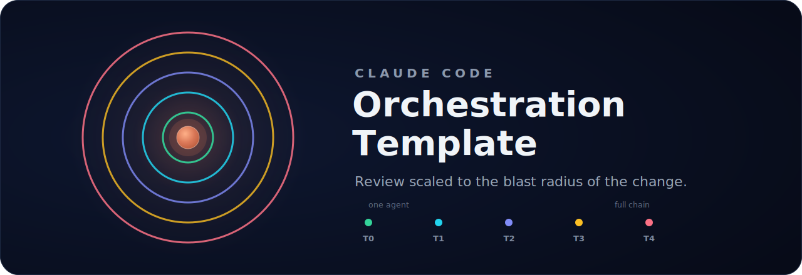

<p align="center">
  
</p>

# Claude Code Orchestration Template

The orchestrator reads each task, rates how much it could break on a scale of 0 to 4, and routes it through the matching chain of agents. A typo runs one agent. A new security-critical component runs the whole chain: design, code review, an offensive and a defensive security pass, then docs. The higher the tier, the longer the chain.

```
 Tier 0    developer → docs
 Tier 1    developer → quality-gate → docs
 Tier 2    architect → quality-gate → developer → quality-gate → docs
 Tier 3    architect → quality-gate → developer → quality-gate → hunter / defender → docs
 Tier 4    architect → quality-gate → developer → quality-gate → hunter → defender → docs
```

It's configuration, not code: one `CLAUDE.md` and a `.claude/` folder. Copy a team into your project, run `/bootstrap`, and start working. I built it for my own work and it's on its second version now. Sharing it in case it's useful, no expectations.

## How it works

Running several agents on a codebase is the easy part. The judgment is the hard part: not wrapping a one-line fix in ceremony it doesn't need, and not letting a risky change through without the review it does. The template encodes that as rules that don't bend.

The tier follows the risk. New files push a task to at least tier 2, external I/O or a new security surface to tier 3, a new major component or anything security-critical to tier 4. When the orchestrator is unsure between two, it picks the higher one. docs always runs last.

From there, a few things hold the chain together.

Review agents return a verdict, PASS or FAIL. FAIL stops the chain and sends the work back with a numbered fix list. Three failures on the same gate trip a circuit breaker that escalates to you instead of looping — repeated failures mean the spec or the design is wrong, not the code.

Review agents are read-only. They carry `disallowedTools: [Edit, Write, Bash]`, so they can't touch the code they're reviewing, not even through a shell redirect. They report findings; they don't patch them.

Agents load their own rules. The orchestrator passes only the task: what, why, scope, and the handoff from the previous agent. Never project conventions, never `CLAUDE.md`. Each agent reads those itself, every time. Stale context can't leak between steps, and the prompts stay lean.

The knowledge hierarchy is strict. `CLAUDE.md` and agent instructions beat project docs, which beat the engineering skills, which beat an agent's private notes. Every conflict resolves the same way.

Agents keep working notes in `.agentNotes/`, never committed. Read-only agents can't write their own, so they emit a notes section and the orchestrator persists it for them.

Six slash commands cover the routine work: `/bootstrap`, `/tier-check`, `/commit`, `/push`, `/re-review`, `/deep-analysis`. For token and cost numbers use Claude Code's own `/usage`, or the OTEL telemetry setup in `.claude/docs/telemetry.md` — earlier versions had a `/chain-metrics` skill that estimated these, but estimated metrics dressed up as measurements are worse than none.

A safety hook blocks destructive git before it runs. The PreToolUse hook catches force pushes (including the short `-f` and refspec forms), `reset --hard`, `clean -f`, and `rm -rf`. Its block-and-pass list is checked in CI, alongside the agent definitions and the skills layer.

## Engineering skills (software-development team)

The software-development team adds a second layer on top of the chain. The chain already maps onto the engineering lifecycle — define, plan, build, verify, review, ship — so each agent runs under the practices that belong to its step. The developer works under test-driven and incremental-implementation doctrine; the quality gate under code-review and simplification; the security agents under hardening. Nothing "calls" a skill: being the developer in the build phase means operating under those practices. The tier sets how many phases run, so it also sets how much doctrine applies.

These practices are 23 skill files vendored from [addyosmani/agent-skills](https://github.com/addyosmani/agent-skills) (MIT), kept byte-for-byte identical to upstream so updates re-pull cleanly. Everything that binds them to this framework lives in one bridge file, `INTEGRATION.md`. Bootstrap works out which skills your project actually needs — a CLI tool doesn't need browser-testing — and drops the rest.

The agents apply them with judgment, not by rote. On a small lint cleanup I watched the developer skip TDD on its own and say why, quoting the skill's own "when not to use". The doctrine doesn't bury small tasks in process. This layer is what improved my results the most.

## Quick start

```bash
git clone https://github.com/Hub3r7/claude-code-orchestration-template.git

TEAM=software-development   # or devops-sre / data-engineering / research-analysis
cp claude-code-orchestration-template/teams/$TEAM/CLAUDE.md /path/to/your/project/
cp -r claude-code-orchestration-template/teams/$TEAM/.claude /path/to/your/project/
# optional: enable the safety hook
cp .../teams/$TEAM/.claude/settings.template.json /path/to/your/project/.claude/settings.json
```

Then open Claude Code in your project and run `/bootstrap`. It asks about your project (stack, structure, conventions, what's sensitive), confirms what it understood, proposes a model for each agent and which skills to switch on, and then fills in every `[PROJECT-SPECIFIC]` section across the files. After that, tasks get classified and routed on their own.

It needs Claude Code. It's built on Claude Code's sub-agent system (`.claude/agents/*.md` and `CLAUDE.md`), so it won't work with other AI tools or IDEs. Each team is self-contained, with no dependencies on the others.

## The teams

Four teams, same machinery — tiers, gates, handoffs, the hierarchy, bootstrap.

- **software-development** — the one I actually use, and the only one with the engineering-skills layer. Seven agents: architect, ui-designer, developer, quality-gate, hunter (offensive security), defender (defensive security), docs.
- **devops-sre** — infrastructure and reliability work.
- **data-engineering** — pipelines and data work.
- **research-analysis** — non-code research, with a researcher, critic, and visualizer in place of developers.

To build your own, copy a team folder, rename the agents and adjust their roles, edit the tier table for your workflow, and update the bootstrap questions. Keep the core protocols — handoff, PASS/FAIL, the hierarchy, agent notes — and it holds together. None of this is specific to software.

## What to expect

The software-development team is where the work went, and the part I trust. The other three share the same protocols but I've run them far less — expect to refine their agent instructions as you go. It's a personal project in active use, so it has rough edges. That's fine: it's a second version, not a finished product.

It spends tokens. Multi-agent review costs more than a single pass, and the skills layer adds more again. That's the trade for the depth — worth knowing before you point it at everything.

## Credit and license

The engineering skills are vendored from [addyosmani/agent-skills](https://github.com/addyosmani/agent-skills) by Addy Osmani (MIT). Credit to that project for the doctrine. Everything else is MIT as well; see [LICENSE](LICENSE).

Questions or feedback: hub3r7@pm.me
