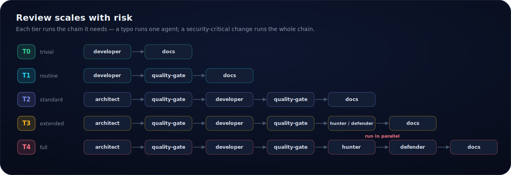
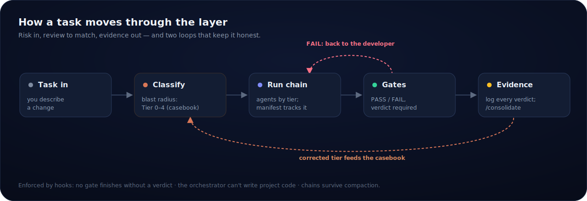

<p align="center">
  
</p>

# Claude Code Orchestration Template

**What it is.** A control layer for Claude Code. It reads each task, rates how much it could break on a scale of 0 to 4, routes it through the matching chain of agents, and enforces the protocol with hooks — not prose-only instructions.

**Why it exists.** Running several agents on a codebase is the easy part; the judgment is the hard part. A one-line fix should not be wrapped in ceremony it doesn't need, and a risky change should not slip through without the review it does. This layer makes that judgment explicit and mechanical.

**Why it's different.** It is not another skill pack. It vendors [Addy Osmani's agent-skills](https://github.com/addyosmani/agent-skills) byte-for-byte as its engineering-doctrine layer, then adds the control plane around them: blast-radius tiering, agent chains, hook-enforced gates, durable chain state, a casebook that learns your project's risk topology, and an evidence log. It is Claude Code-specific by design.

<p align="center">
  
</p>

## How it works

<p align="center">
  
</p>

1. **Task in** — you describe a change.
2. **Tier classification (0–4)** — the orchestrator rates blast radius, calibrated by the casebook.
3. **Chain manifest** — `chain.sh` writes tier, plan, and position to `.agentNotes/chain-state.json`.
4. **Agent execution** — the matching chain runs (design → build → review), each agent self-loading its doctrine.
5. **Gates** — review agents issue PASS/FAIL; a FAIL loops back with a numbered fix list; hooks enforce that no gate finishes without a verdict.
6. **Verdict log** — every verdict and chain outcome is appended to `.agentNotes/chain-log.jsonl`.
7. **Consolidation** — `/consolidate` turns the log into calibration: recurring findings become project rules, corrected tiers become casebook cases.

## The casebook that learns

Rules calibrate poorly on borderline cases; examples calibrate well. So the tier decision is backed by a casebook of worked examples — "major-version bump of a core framework" is tier 3 while "patch bump, lockfile only" is tier 1, and each case records *why*. Bootstrap seeds it from your project's own risk topology, and every corrected tier decision is appended as a new case, so classification converges on your project's instincts instead of drifting: a learning blast-radius classifier, written in markdown.

Each case also exists as a machine-readable JSONL record whose change characteristics — new files, shared code, external I/O, persistence, security surface, new component — mirror the tier rules one-to-one (`casebook-format.md` defines the schema; CI keeps the record and the table in sync). Casebooks are therefore portable: shareable between projects, aggregatable into a corpus, or usable as labeled data for evaluating how well a model estimates blast radius.

## Enforced, not promised

Instructions bend under context pressure; hooks don't. A hook suite ships in `settings.template.json`:

- **Verdicts are mandatory.** A review agent cannot finish without an explicit PASS/FAIL verdict or a declared BLOCKED state. Every verdict is recorded.
- **The circuit breaker is physical.** After three FAILs on the same gate, the next re-review is blocked outright — the orchestrator must escalate to you; it cannot quietly keep looping.
- **Reviewers can't touch code.** `disallowedTools` keeps every gate and consultant read-only, down to shell redirects.
- **The orchestrator can't either.** A hook blocks main-session writes outside meta-configuration — including the common shell write forms (redirection, `tee`, `sed -i`) against existing project files. Code goes through the developer, or it doesn't go.
- **Chains survive long sessions.** A chain manifest holds tier, plan, and position; after a compaction, a restart, or `/resume`, a hook re-injects it. One canonical writer (`chain.sh`) owns the manifest, so no model hand-edits state.
- **Turns don't end mid-chain silently.** A stop guard refuses the orchestrator's first attempt to end a turn with an unfinished chain. Circuit-breaker escalations pass through.
- **One semantic check.** A prompt hook on the small, cheap model verifies what regex can't: that a FAIL carries a numbered fix list and a PASS handoff carries acceptance criteria.
- **Destructive git is stopped twice.** A regex hook catches force pushes, `reset --hard`, `clean -f`, and `rm -rf` including combined flag forms; underneath, `permissions.deny` rules and Claude Code's OS sandbox add a categorical layer where the platform supports it.

The default posture is auto mode inside the OS sandbox, with the enforcement layer itself behind an approval gate: edits to the hooks or settings prompt for human confirmation. The status line shows the live chain — `T3 ▸ 2/6 ▸ next: developer ▸ FAIL quality-gate:1` — straight from the manifest, at zero token cost.

## The team

Eleven agents. Seven run the chain: architect, ui-designer, developer, quality-gate, hunter (offensive security), defender (defensive security), docs. Four consultants sit outside the tiers: critic (fresh-eyes challenge to designs and reasoning), incident (production-failure perspective), optimizer (performance deep-dives), researcher (cited web research for technology decisions). Consultants inform, they don't gate — no verdicts, read-only, pulled in when a chain or you wants a second perspective.

Cost defaults are deliberate: the developer runs on Sonnet (the orchestrator may one-off override to Opus for genuinely complex tier 3-4 work, and says so), the routine gate reviews at medium effort, the security agents stay at high. Bootstrap asks before raising any of it.

## Relationship to Addy Osmani's agent-skills

The engineering doctrine — *how* to do each lifecycle phase well — is not mine. It is [addyosmani/agent-skills](https://github.com/addyosmani/agent-skills) (MIT), and this project treats it with care:

- **Vendored byte-for-byte.** All 23 `SKILL.md` files are copied verbatim into `template/.claude/agent-skills/`, pinned to an upstream commit. They are not rewritten, summarized, or forked.
- **MIT license and credit preserved.** The upstream license and attribution travel with the files; nothing about their provenance is obscured.
- **This project adds control, not replacement doctrine.** The tiering, gates, hook enforcement, chain state, casebook, and evidence log are the contribution. The skills remain the authoritative doctrine — on any conflict between a skill and this framework's glue, the read protocol defers to the skill.
- **Integration lives outside the vendored files.** Everything binding the skills to this framework is in one bridge file, `INTEGRATION.md`, plus a distilled ten-line *operating card* per skill — so the vendored `SKILL.md` files stay pristine and re-pull cleanly.
- **Upstream drift is tracked.** A monthly CI job diffs the vendored copies against upstream and reports drift; the operating cards regenerate on refresh.

Credit to Addy Osmani for the doctrine layer this framework depends on. (This project is not affiliated with or endorsed by agent-skills.)

**Two-tier read.** Each chain position maps to a lifecycle phase (define, plan, build, verify, review, ship) and operates under the skills for that phase — nothing "calls" a skill; being the developer in the build phase *means* working under TDD and incremental-implementation. Agents read the ten-line operating card every time and open the full doctrine only when a go-deep trigger fires, so depth is paid for when it matters. Bootstrap works out which skills your project actually needs — a CLI tool doesn't need browser-testing — and deactivates the rest.

## When to use it — and when not

**Use it when:** you run multi-agent work on a codebase and want risk-proportionate review; you want the protocol enforced rather than hoped for; you keep a durable, auditable record of what the review chain decided; or you want tier classification that learns your project's risk topology over time.

**Don't reach for it when:** you want a single fast pass (the tiers add agents, which adds tokens); you need formal security assurance (an agent PASS is a review signal, not a proof); you're not on Claude Code (it is built on its sub-agent system, hooks, and skills and won't work elsewhere); or the task is trivial and you'd rather just edit the file.

## Quick start

```bash
git clone https://github.com/Hub3r7/claude-code-orchestration-template.git

cp claude-code-orchestration-template/template/CLAUDE.md /path/to/your/project/
cp -r claude-code-orchestration-template/template/.claude /path/to/your/project/
# recommended: enable the hook suite, sandbox, and status line
cp /path/to/your/project/.claude/settings.template.json /path/to/your/project/.claude/settings.json

# verify the install
cd /path/to/your/project && bash .claude/scripts/doctor.sh
```

**Requirements.** Claude Code, plus the POSIX shell toolchain the hooks and the chain manifest are built on: `bash`, `git`, `jq`, and coreutils (`grep`, `sed`, `md5sum`). There is **no language runtime** — nothing you copy into your project runs Python (the repo's own CI validators do, but they don't ship in `template/`). `jq` is a hard dependency: the hooks parse tool input with it and **fail closed** without it, so install it before your first chain. On Windows, run under WSL or Git Bash. `bash .claude/scripts/doctor.sh` checks the toolchain is present.

**Your first chain:**

1. `bash .claude/scripts/doctor.sh` — confirm the install is healthy.
2. `/bootstrap` — it profiles the project, proposes models and active skills, and seeds a starter casebook.
3. Give it a small bug fix (a **Tier 1** task) — watch the chain manifest, the status line, and the verdict log.
4. Give it something with external I/O or a security surface (a **Tier 3/4** task) — it will ask for approval first and run the security agents.
5. Inspect the evidence: `.agentNotes/chain-log.jsonl` and `.claude/docs/tier-casebook.md`. Run `/consolidate` for the calibration report.

The one-page [operator guide](template/.claude/docs/operator-guide.md) covers the daily commands, the status line, and what to do when a gate blocks something.

## Repository layout

- `template/` — the product: the `CLAUDE.md` and `.claude/` you copy into your project
- `scripts/` — the CI validators and the hook test suite

## Adapting it

The template ships as a single software-development team — one copy of the machinery, kept sharp. An earlier four-team layout (devops-sre, data-engineering, research-analysis) is preserved at the git tag [`four-teams`](../../tree/four-teams) as an adaptation reference. To adapt to another domain: rename the agents and adjust their roles, edit the tier table, update the bootstrap questions. The core protocols — handoff, PASS/FAIL, the knowledge hierarchy, agent notes — carry over unchanged; none are specific to software.

## Trade-offs

Multi-agent review costs more tokens than a single pass — that is the price of the depth. The tiers scale that price to the risk and the operating cards cut the fixed overhead, but a tier 4 chain is still seven agent runs. It is Claude Code-only, and it complements CI, human review, and security tooling rather than replacing them.

## Credit and license

The engineering skills are vendored byte-for-byte from [addyosmani/agent-skills](https://github.com/addyosmani/agent-skills) by Addy Osmani, under the MIT license — full credit to that project for the doctrine layer, which this framework depends on. Everything else here is MIT as well; see [LICENSE](LICENSE).

Feedback welcome: hub3r7@pm.me
